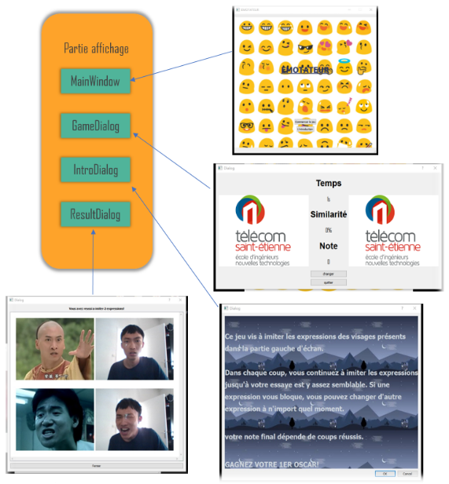
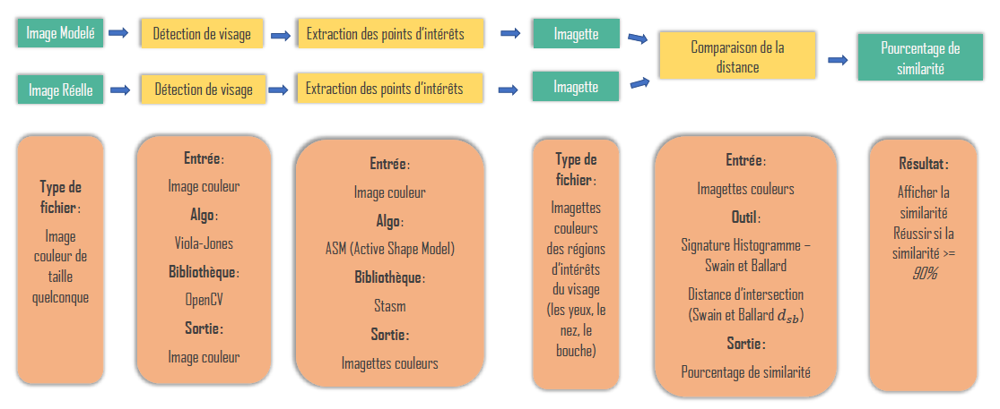
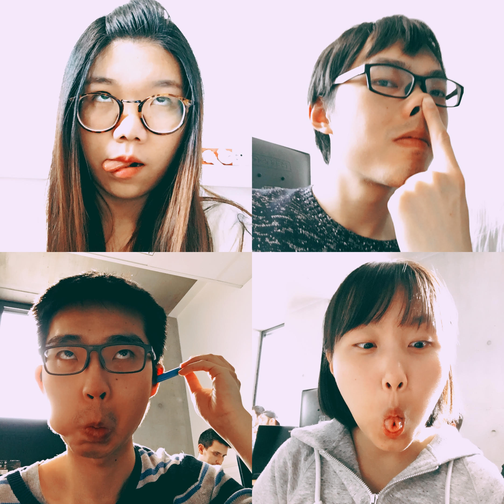

## EMOTATEUR

- **Nom d'equipe:** EMOTATEUR
- **Membre d'equipe:**

| NOM   | Prenom  |
| ----- | ------- |
| YAN   | Yutong  |
| ZHANG | Heng    |
| XU    | Sixiang |
| SUN   | Yunyun  |

- **L'interface graphique:**

- **L'architecture su systeme:**

  

- **Photo du group:**

  

- **Sujet detaille:**

  - Un jeu vis a imiter les expressions des visages differents pendant une duree limitee en testant la similarite entre l'imitation et l'image de reference. Le note finale tient compte le nombre des coups reussits.

- **Cahier de charge:**

  1. Detection de visage;
  2. Extraction des caracteristiques d'un visage;
  3. Comparison entre deux expressions;
  4. Realisation du systeme(Interface graphique).

- **Problematique couleur:**

  1. Discripteur de couleur pour la detection de visage;
  2. Discripteur de couleur pour la extraction des caracteristiques d'un visage.

  3. Analyser l'expression d'utilisateur;
  4. Calculer la similarite entre l'imitation et l'image de reference;
  5. Creation de la synthese de resultat de jeu;
  6. Creation d'interface graphique.

  7. L'utilisation de la bibliotheque OpenCv;
  8. L'utilisation de la bibliotheque Qt;
  9. Application des algorithmes differentes concernant la detection de visage, la reconnaissance de l'expression.

  10. opencv, qt
  11. Algorithme Haar-cascade pour la detection de visage

  - Decouvrir l'utilisation de opencv
  - Detection de visage
  - Interface graphique principale
  - Extraction des points d'interets de visage

